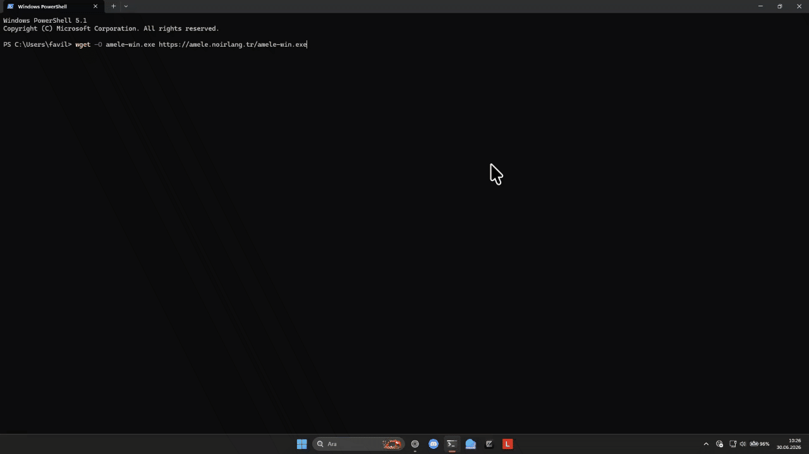

<div align="center">


# Amele Windows Agent


</div>

## Turkce

Bu depo, Amele ana uygulamasi icin Windows Agent bileşenini icerir.

- Ana repo: https://github.com/noirlang/amele
- Windows Agent repo: https://github.com/noirlang/amele-win
- Web sitesi: https://amele.noirlang.tr

### Hazir EXE Indirme

```bash
wget -O amele-win.exe https://amele.noirlang.tr/amele-win.exe
```

### Windows'ta EXE Derleme

`amele-win.exe` Windows uzerinde derlenmelidir. Linux uzerinde bu agent dogrudan derlenmez; Windows API ve pywin32 bagimliliklari gerekir.

Windows makinede:

```powershell
py -m venv .venv
.\.venv\Scripts\Activate.ps1
py -m pip install --upgrade pip
pip install -r requirements.txt
pip install pyinstaller
pyinstaller --onefile --windowed --name amele-win windows.py
```

Cikti dosyasi:

```text
dist\amele-win.exe
```

### Calistirma

1. `amele-win.exe` dosyasini yonetici yetkisi ile calistirin.
2. Gerekirse port ve token ayarlarini girin.
3. Agent ekranda dinlenen baglanti bilgisini gosterecektir.

### Ana Uygulama ile Baglanti

1. Amele masaustu uygulamasinda Windows araclari ekranina gecin.
2. Agent'ta gordugunuz IP/Port degerlerini uygulamaya girin.
3. Baglanin ve edinim adimlarini baslatin.

### CI / Otomatik Derleme

Bu repo **GitHub Actions** ile otomatik derleme yapar.

Pipeline yalnizca commit mesajinda `[build]` etiketi varsa tetiklenir:

```bash
git commit -m "feat: yeni özellik [build]"
```

Etiketsiz commit'ler push edilir ama derleme baslatilmaz.

**Manuel tetikleme:** GitHub Actions sekmesinde "Run workflow" butonu.

Pipeline adimlari:
1. `metadata` — commit slug ve SHA hesaplar
2. `build` — Python 3.12 + PyInstaller ile `amele-win.exe` uretir
3. `release` — GitHub Releases'a prerelease olarak yukler

---


## English

This repository contains the Windows Agent component for the Amele main application.

- Main repo: https://github.com/noirlang/amele
- Windows Agent repo: https://github.com/noirlang/amele-win
- Website: https://amele.noirlang.tr

### Download Prebuilt EXE

```bash
wget -O amele-win.exe https://amele.noirlang.tr/amele-win.exe
```

### Build EXE on Windows

`amele-win.exe` must be built on Windows. It is not built directly on Linux because it uses Windows APIs and pywin32.

On a Windows machine:

```powershell
py -m venv .venv
.\.venv\Scripts\Activate.ps1
py -m pip install --upgrade pip
pip install -r requirements.txt
pip install pyinstaller
pyinstaller --onefile --windowed --name amele-win windows.py
```

Output:

```text
dist\amele-win.exe
```

### Run

1. Run `amele-win.exe` as Administrator.
2. Configure port/token settings if needed.
3. The agent UI will display listening connection details.

### Connect with Main App

1. Open the Windows tools section in the Amele desktop app.
2. Enter the same IP/Port values shown by agent.
3. Connect and start acquisition workflows.
